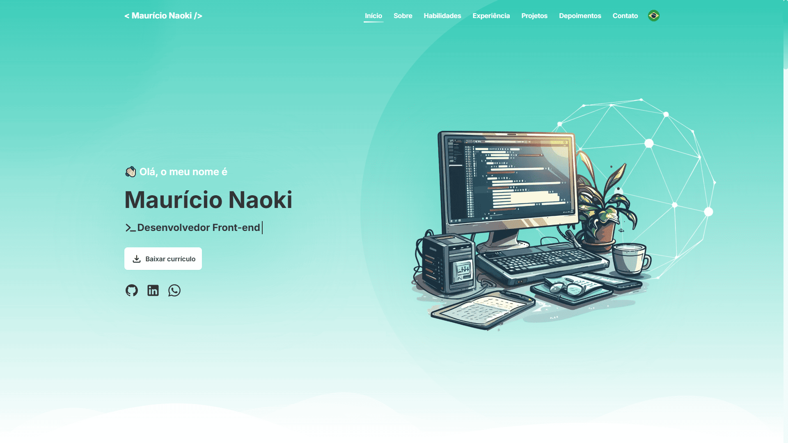
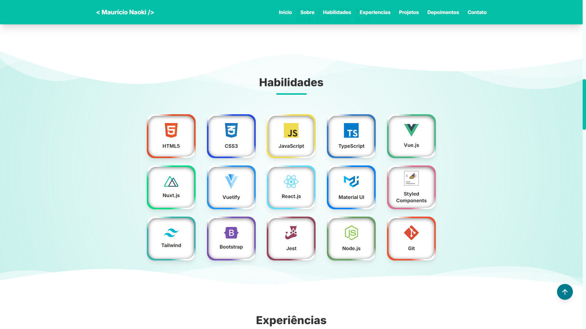
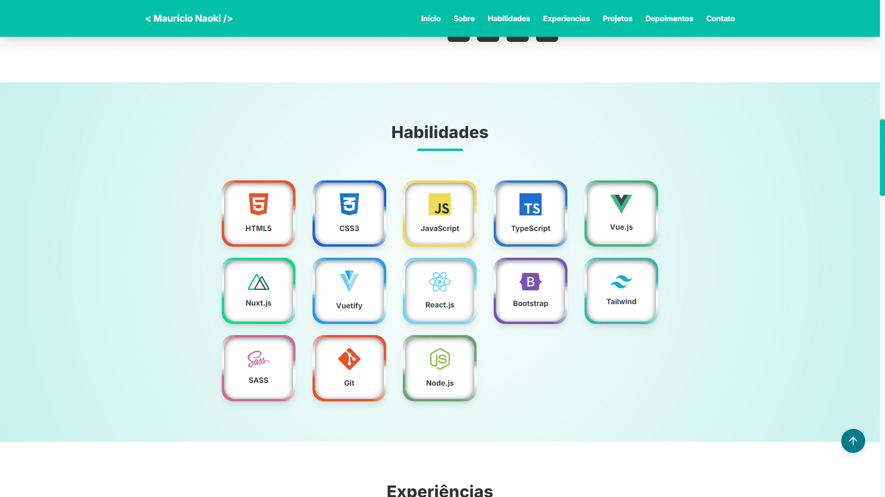
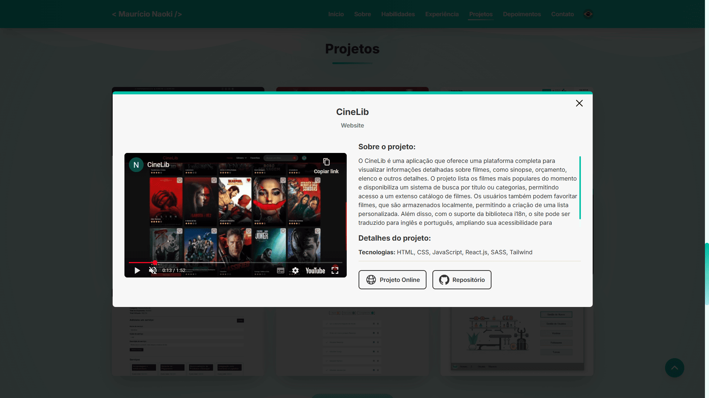

<div align="center"> <h1>Meu Portfólio</h1> </div>

<p align="center">
  Explore meu portfólio e conheça mais sobre minhas habilidades, experiências e projetos realizados!
</p>

<p align="center">
  
  
  
  
  
</p>

## 📝 Sobre o projeto

Este projeto tem como objetivo de apresentar minhas habilidades, experiências profissionais e os principais projetos que desenvolvi. Além de mostrar as tecnologias que domino, ele oferece exemplos práticos do desenvolvimento web e outras tecnologias. É um espaço para conhecer mais sobre mim e meu cuidado com a usabilidade e boas práticas de design e código.

## 🛠 Tecnologias utilizadas

-   **Vue.js** - Framework JavaScript progressivo
-   **Nuxt.js** - Framework baseado em Vue.js para SSR
-   **Nitro** - Camada de servidor do Nuxt para backends e APIs
-   **JavaScript** - Linguagem de programação para desenvolvimento web
-   **HTML** - Linguagem de marcação que estrutura o conteúdo na web
-   **CSS** - Linguagem de estilos usada para definir o visual das interfaces web
-   **Tailwind CSS** - Framework de estilos

## 🤔 Por que optei por usar um backend no meu projeto frontend?

Durante o desenvolvimento do formulário de contato, notei que, ao utilizar uma solução somente em frontend (como o Web3Forms), a chave de API ficava exposta, gerando riscos de segurança. 

Para resolver esse problema, optei por utilizar o Nitro, um framework que já vem integrado ao Nuxt 3. Com ele, pude processar as informações no backend, garantindo maior privacidade e controle sobre os dados, sem depender de terceiros. 

Essa abordagem me permitiu desenvolver uma solução mais segura e customizada.

## 📸 Screenshots

<p align="center">
  
</p>

<p align="center">
  
</p>

<p align="center">
  
</p>

<p align="center">
  
</p>

## 🌐 Acesse o projeto online
Você pode acessar a versão online do projeto [aqui](https://mauricionaokidev.netlify.app).

## 🖥️ Como configurar o projeto

Siga os passos abaixo para instalar e executar o projeto em seu ambiente local:

### 1. Clone o repositório:

```bash
$ git clone https://github.com/mauricio071/Portfolio-Mauricio-Naoki
```

### 2. Acesse o diretório do projeto:

```bash
$ cd Portfolio-Mauricio-Naoki
```

### 3. Instale as dependências necessárias:

```bash
$ npm install
```
ou

```bash
$ yarn install
```

### 4. Configure o ambiente:

No arquivo .env, insira seu email e senha:

```bash
EMAIL_USER=SEU-EMAIL
EMAIL_KEY=SENHA-EMAIL
```

### 5. Inicialize o projeto:

```bash 
$ npm run dev
```
ou, se estiver usando yarn:

```bash 
$ yarn dev
```
Agora você pode acessar o projeto no navegador em http://localhost:3000 (ou na porta indicada pelo terminal).
